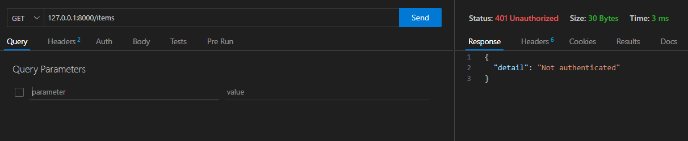
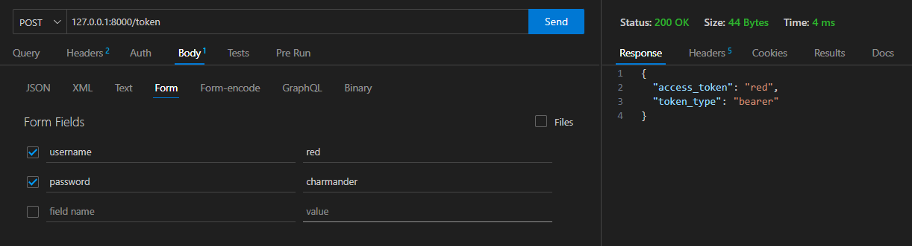

# Protegendo uma API v1.0

O objetivo deste projeto é criar uma API com FastAPI com rotas protegidas.
Ela será uma API básica, com o objetivo de apresentar como proteger uma API com FastAPI. Ela será deployada em um container Docker, utilizando um arquivo docker-compose.


## Requisitos

- Python >= 3.8
- FastAPI
- Uvicorn
- Docker

## Recomendação de Leitura

- [How to Add JWT Authentication in FastAPI – A Practical Guide](https://www.freecodecamp.org/news/how-to-add-jwt-authentication-in-fastapi/)
- [FastAPI Security - First Steps](https://fastapi.tiangolo.com/tutorial/security/first-steps/)
- [The password flow](https://fastapi.tiangolo.com/tutorial/security/first-steps/#the-password-flow)

## Instalação

As bibliotecas necessárias para a execução do projeto estão no arquivo `requirements.txt`. Para instalar, execute o comando abaixo:

```bash
python -m pip install -r requirements.txt
```

> ***ATENÇÃO:*** *É recomendado a utilização de um ambiente virtual para a instalação das bibliotecas. Para mais informações, acesse o [link](https://docs.python.org/pt-br/3/library/venv.html).*

Para criar um ambiente virtual, execute o comando abaixo (para Windows):

```bash
python -m venv .
cd Scripts
activate
```

O que vai acontecer com a sequencia de comandos acima, um ambiente virtual será criado na pasta atual. Em sequencia, navegamos para o diretório ***Scripts***, e ativamos o ambiente virtual executando o script ***activate***. Na sequencia, vamos avaliar se o ambiente virtual foi ativado corretamente, executando o comando abaixo:

```bash
where python
```

A saída esperada é a seguinte:

```bash
C:\Users\usuario\Documents\api-autenticacao\Scripts\python.exe
C:\Users\usuario\AppData\Local\Programs\Python\Python38\python.exe
```

Os diretórios que são criados para o ambiente virtual são:
- Include
- Lib
- Scripts

Esses diretórios e o arquivo ***pyvenv.cfg*** são criados na pasta onde o comando ***python -m venv .*** foi executado. Eles podem ser adicionados ao ***.gitignore***, pois se for necessário recriar esses diretórios, basta recriar o venv. Exemplo de gitignore:

```gitignore
Include
Lib
Scripts
pyvenv.cfg
```

Para desativar o ambiente virtual, execute o comando abaixo, dentro do diretório Scripts:

```bash
deactivate
```

## Desenvolvimento do Projeto

Para desenvolvermos nossa aplicação, vamos criar um arquivo ***main.py*** na raiz do projeto, com o seguinte conteúdo:

```python
from fastapi import FastAPI

app = FastAPI()


@app.get("/")
async def root():
    return {"message": "Hello World"}
```

Esse arquivo será a base para nossa aplicação. Ele é o exemplo padrão da documentação do FastAPI. Para executar a aplicação, execute o comando abaixo:

```bash
uvicorn main:app 
```

Vamos alterar a aplicação para que ela possua uma rota protegida. Vamos utilizar o pacote ***python-multipart*** para pegar dados do tipo ***form***. Essa dependencia já está no ***requeriments.txt***. Vamos alterar nosso arquivo para:

```python
from typing import Annotated

from fastapi import Depends, FastAPI
from fastapi.security import OAuth2PasswordBearer

app = FastAPI()

# Para utilizar o validador de segurança, é necessário criar uma instância do OAuth2PasswordBearer
oauth2_scheme = OAuth2PasswordBearer(tokenUrl="token")


@app.get("/")
async def root():
    return {"message": "Hello World"}

@app.get("/items/")
async def read_items(token: Annotated[str, Depends(oauth2_scheme)]):
    return {"token": token}
```

Agora ao executar nossa aplicação, a rota raiz continua disponível, mas a rota ***items*** apenas devolve o seguinte valor:



Agora vamos criar alguns usuários para a nossa aplicação. Esses usuários ficaram apenas em memória, e serão utilizados para autenticar as requisições recebidas. Vamos alterar nosso arquivo ***main.py*** para:

```python
from typing import Annotated

from fastapi import Depends, FastAPI
from fastapi.security import OAuth2PasswordBearer

# Cria um conjunto de usuários para simular um banco de dados
fake_users_db = {
    "red": {
        "username": "red",
        "full_name": "Ask Ketchum",
        "email": "pikachu@mail.com",
        "hashed_password": "charmander",
        "disabled": False,
    },
    "gary": {
        "username": "gary",
        "full_name": "Gary Oak",
        "email": "grandson@mail.com",
        "hashed_password": "eevee",
        "disabled": True,
    },
}

# Restante do código
```

Agora vamos alterar o nosso código para que ele possa lidar com as requisições de autenticação. Vamos alterar o arquivo ***main.py*** para:

```python
from typing import Annotated

from fastapi import Depends, FastAPI, HTTPException, status
from fastapi.security import OAuth2PasswordBearer, OAuth2PasswordRequestForm
from pydantic import BaseModel

# Cria um conjunto de usuários para simular um banco de dados
fake_users_db = {
    "red": {
        "username": "red",
        "full_name": "Ask Ketchum",
        "email": "pikachu@mail.com",
        "hashed_password": "charmander",
        "disabled": False,
    },
    "gary": {
        "username": "gary",
        "full_name": "Gary Oak",
        "email": "grandson@mail.com",
        "hashed_password": "eevee",
        "disabled": True,
    },
}


app = FastAPI()

# Para utilizar o validador de segurança, é necessário criar uma instância do OAuth2PasswordBearer
oauth2_scheme = OAuth2PasswordBearer(tokenUrl="token")


# Classes que definem os usuários
class User(BaseModel):
    username: str
    email: str | None = None
    full_name: str | None = None
    disabled: bool | None = None
    hashed_password: str | None = None

    


def get_user(db, username: str) -> User:
    if username in db:
        user_dict = db[username]
        return User(**user_dict)

def fake_decode_token(token):
    # This doesn't provide any security at all
    user = get_user(fake_users_db, token)
    return user

# Funções para lidar com os usuários, todas demandam um token de autenticação
async def get_current_user(token: Annotated[str, Depends(oauth2_scheme)]):
    user = fake_decode_token(token)
    if not user:
        raise HTTPException(
            status_code=status.HTTP_401_UNAUTHORIZED,
            detail="Invalid authentication credentials",
            headers={"WWW-Authenticate": "Bearer"},
        )
    return user


async def get_current_active_user(
    current_user: Annotated[User, Depends(get_current_user)]
):
    if current_user.disabled:
        raise HTTPException(status_code=400, detail="Inactive user")
    return current_user


# Função para autenticar o usuário
@app.post("/token")
async def login(form_data: Annotated[OAuth2PasswordRequestForm, Depends()]):
    try:
        user_dict = User(**fake_users_db.get(form_data.username))
    except:
        raise HTTPException(status_code=400, detail="User not found")
    if not user_dict:
        raise HTTPException(status_code=400, detail="Incorrect username or password")
    if not form_data.password == user_dict.hashed_password:
        raise HTTPException(status_code=400, detail="Incorrect username or password")

    return {"access_token": user_dict.username, "token_type": "bearer"}

# Nossa API
@app.get("/")
async def root():
    return {"message": "Hello World"}

@app.get("/items/")
async def read_items(token: Annotated[str, Depends(oauth2_scheme)]):
    return {"token": token}
```

Diversas elementos foram adicionados ao código. Vamos avaliar cada um deles:
- A classe ***User*** foi criada para definir o modelo de usuário
- A função ***get_user*** foi criada para retornar um usuário, dado um username
- A função ***fake_decode_token*** foi criada para decodificar o token recebido
- A função ***get_current_user*** foi criada para retornar o usuário atual, dado um token
- A função ***get_current_active_user*** foi criada para retornar o usuário atual, dado um token, e verificar se o usuário está ativo
- A função ***login*** foi criada para autenticar o usuário, e retornar um token de acesso. Ela está localizada na rota ***/token***

Agora, para acessar as rotas protegidas, vamos primeiro acessar a rota ***/token***, passando os campos ***username*** e ***password*** como ***Form Fields***. A saída esperada é a seguinte:



Com o ***token*** gerado na saída acima, vamos acessar a rota ***/items***, passando o token como ***Bearer Token***. A saída esperada é a seguinte:


## Docker

- TODO
