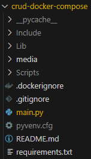
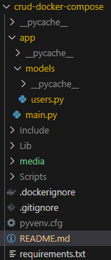

# CRUD com FastAPI, SQLAlchemy e PostgreSQL v1.0

O objetivo deste projeto é apresentar uma sugestão de estrutura para o desenvolvimento de uma API com FastAPI, SQLAlchemy e PostgreSQL. Ela será deployada em um conjunto de imagens Docker, que serão todas lançadas utilizando um arquivo ***docker-compose***.
Durante a construção desta API, o processo será implementado utilizando uma abordagem incremental, onde cada passo será documentado e versionado. O objetivo é apresentar uma sugestão de estrutura para o desenvolvimento de uma API com FastAPI, SQLAlchemy e PostgreSQL.

## Requisitos

- Python >= 3.8
- FastAPI
- Uvicorn
- Docker
- SQLAlchemy >= 2.0
- psycopg2-binary

## Recomendação de Leitura

- [A Psycopg 2 vs Psycopg3 (3.0.15) benchmark](https://www.spherex.dev/psycopg-2-vs-psycopg3/)

## Instalação

As bibliotecas necessárias para a execução do projeto estão no arquivo `requirements.txt`. Para instalar, execute o comando abaixo:

```bash
python -m pip install -r requirements.txt
```

> ***ATENÇÃO:*** *É recomendado a utilização de um ambiente virtual para a instalação das bibliotecas. Para mais informações, acesse o [link](https://docs.python.org/pt-br/3/library/venv.html).*

Para criar um ambiente virtual, execute o comando abaixo (para Windows):

```bash
python -m venv .
cd Scripts
activate
```

O que vai acontecer com a sequencia de comandos acima, um ambiente virtual será criado na pasta atual. Em sequencia, navegamos para o diretório ***Scripts***, e ativamos o ambiente virtual executando o script ***activate***. Na sequencia, vamos avaliar se o ambiente virtual foi ativado corretamente, executando o comando abaixo:

```bash
where python
```

A saída esperada é a seguinte:

```bash
C:\Users\usuario\Documents\crud-docker-compose\Scripts\python.exe
C:\Users\usuario\AppData\Local\Programs\Python\Python38\python.exe
```

Os diretórios que são criados para o ambiente virtual são:
- Include
- Lib
- Scripts

Esses diretórios e o arquivo ***pyvenv.cfg*** são criados na pasta onde o comando ***python -m venv .*** foi executado. Eles podem ser adicionados ao ***.gitignore***, pois se for necessário recriar esses diretórios, basta recriar o venv. Exemplo de gitignore:

```gitignore
Include
Lib
Scripts
pyvenv.cfg
```

Para desativar o ambiente virtual, execute o comando abaixo, dentro do diretório Scripts:

```bash
deactivate
```

## Desenvolvimento do Projeto

A primeira versão do projeto será construída e refatorada para chegarmos ao projeto final. Para construir o projeto, vamos realizar um CRUD de usuários, onde cada usuário terá um nome, e-mail e senha. Para isso, vamos utilizar o FastAPI, SQLAlchemy e PostgreSQL.
Nossa tabela de usuários tera o seguinte formato:

| id | name | email | password |
| -- | ---- | ----- | -------- |
| 1  | Goku | kakaroto@email.com | kamehameha |
| 2  | Vegeta | principe@email.com | bulmas2 |

> ***IMPORTANTE:*** para está versão do projeto, ainda não será implementado um bom mecanismo para proteger as senhas dos usuários, elas serão armazenadas como Strings simples no banco de dados. Em versões futuras, será implementado um mecanismo de criptografia para proteger as senhas dos usuários. ***Ë MUITO IMPORTANTE ESTAR CIENTE QUE ESTÁ ABORDAGEM NÃO É RECOMENDADA PARA AMBIENTES DE PRODUÇÃO.***

Nosso banco vai se chamar ***banco-app***, e nossa tabela de usuários vai se chamar ***Users***. Para utilizarmos um banco com o SGBD Postgres, precisamos criar ele primeiro. A utilização do Postgres vai acontecer por sua imagem oficial no Docker Hub, que pode ser encontrada [aqui](https://hub.docker.com/_/postgres). Para criar o banco, vamos utilizar o seguinte comando:

```bash
docker run --name banco-container -e POSTGRES_PASSWORD=postgres -e POSTGRES_USER=admin -e POSTGRES_DB=banco-app -p 5432:5432 -d postgres
```

O que está acontecendo aqui é o seguinte:
- `docker run`: comando para criar um container
- `--name banco-container`: nome do container
- `-e POSTGRES_PASSWORD=postgres`: variável de ambiente para definir a senha do usuário postgres
- `-e POSTGRES_USER=admin`: variável de ambiente para definir o usuário do banco
- `-e POSTGRES_DB=banco-app`: variável de ambiente para definir o nome do banco
- `-p 5432:5432`: mapeamento de porta do container para a máquina local
- `-d postgres`: imagem utilizada para criar o container

Para verificar se o container foi criado corretamente, execute o comando abaixo:

```bash
docker ps
```

A saída esperada é a seguinte:

```bash
CONTAINER ID   IMAGE                           COMMAND                  CREATED              STATUS              PORTS                    NAMES
9c32cd2be4e4   postgres                        "docker-entrypoint.s…"   About a minute ago   Up About a minute   0.0.0.0:5432->5432/tcp   banco-container
```

Para verificar se o banco foi criado corretamente, execute o comando abaixo:

```bash
docker exec -it banco-container psql -U admin -d banco-app
```

A saída esperada é a seguinte:

```bash
psql (15.4 (Debian 15.4-1.pgdg120+1))
Type "help" for help.

banco-app=#
```	

Para sair do banco, execute o comando abaixo:

```bash
\q
```

Agora vamos iniciar nossa aplicação que vai se conectar ao banco. Para isso, vamos criar um arquivo chamado `main.py`, com o seguinte conteúdo:

```python
from fastapi import FastAPI
from sqlalchemy import create_engine
from sqlalchemy.ext.declarative import declarative_base
from sqlalchemy import Column, Integer, String
from sqlalchemy.orm import Session

# Constantes
DB_USER = "admin"
DB_PASSWORD = "postgres"
DB_HOST = "127.0.0.1"
DB_PORT = "5432"
DB_NAME = "banco-app"

# Cria a engine de dados para o postgres
engine = create_engine(f"postgresql+psycopg2://{DB_USER}:{DB_PASSWORD}@{DB_HOST}:{DB_PORT}/{DB_NAME}")

# Cria uma seção no banco
session = Session(engine)

# Cria a base para os modelos
Base = declarative_base()

#Define a tabela base
class User(Base):
    """
    Classe que representa a tabela de Usuários do sistema
    """
    __tablename__ = "Users"

    id = Column(Integer, primary_key=True, autoincrement=True)
    name = Column(String(255), nullable=False)
    email = Column(String(255), nullable=False)
    password = Column(String(255), nullable=False)

    def __repr__(self):
        return f"<User(id={self.id}, name={self.name}, email={self.email}, password={self.password})>"

# Cria a tabela no banco se ela já não existir
Base.metadata.create_all(engine, checkfirst=True)

app = FastAPI()

@app.get("/get_users")
def get_users():
    users = session.query(User).all()
    return {"data":users}
```

O que está acontecendo aqui é o seguinte:
- Importamos a classe FastAPI do pacote fastapi
- Importamos a função create_engine do pacote sqlalchemy
- Importamos a função declarative_base do pacote sqlalchemy.ext.declarative
- Importamos a classe Column, Integer e String do pacote sqlalchemy
- Importamos a classe Session do pacote sqlalchemy.orm
- Criamos uma engine de dados para o postgres
```python
# Constantes
DB_USER = "admin"
DB_PASSWORD = "postgres"
DB_HOST = "127.0.0.1"
DB_PORT = "5432"
DB_NAME = "banco-app"
# Cria a engine de dados para o postgres
engine = create_engine(f"postgresql+psycopg2://{DB_USER}:{DB_PASSWORD}@{DB_HOST}:{DB_PORT}/{DB_NAME}")
```
- Criamos uma seção no banco
```python
# Cria uma seção no banco
session = Session(engine)
```
- Criamos a base para os modelos
- Definimos a tabela base
```python	
# Cria a base para os modelos
Base = declarative_base()

#Define a tabela base
class User(Base):
    """
    Classe que representa a tabela de Usuários do sistema
    """
    __tablename__ = "Users"

    id = Column(Integer, primary_key=True, autoincrement=True)
    name = Column(String(255), nullable=False)
    email = Column(String(255), nullable=False)
    password = Column(String(255), nullable=False)

    def __repr__(self):
        return f"<User(id={self.id}, name={self.name}, email={self.email}, password={self.password})>"
```
- Criamos a tabela no banco se ela já não existir
- Criamos uma instância da classe FastAPI
- Criamos uma rota para a aplicação, que é a rota responsável por trazer todo o conteúdo da tabela Users

Ao utilizarmos o Thunder Client para verificar essa rota, é possível ver que uma lista vazia é retornada:


Agora vamos criar a rota para adicionar um usuário ao banco

```python
from fastapi import FastAPI, Body

# Restante do código anterior

@app.post("/create_user")
def create_user(data: dict = Body()):
    usuario = User(name = data['name'], email = data['email'], password = data['password'])
    session.add(usuario)
    session.commit()
    return {"data": "Usuário criado com sucesso!"}

```

Após executar a rota, é possível ver que o usuário foi criado com sucesso:


Ao testarmos a rota para verificar a lista de usuários, é possível ver que o usuário foi adicionado com sucesso:


Agora vamos criar a rota para atualizar um usuário no banco

```python
# Restante do código anterior

@app.put("/update_user")
def update_user(data: dict = Body()):
    usuario = session.query(User).filter(User.id == data['id']).first()
    usuario.name = data['name']
    usuario.email = data['email']
    usuario.password = data['password']
    session.commit()
    return {"data": "Usuário atualizado com sucesso!"}
```

O retorno da API será:


Agora, vamos criar uma nova rota para deletar um usuário

```python
# Código anterior

@app.delete("/delete_user")
def delete_user(data: dict = Body()):
    usuario = session.query(User).filter(User.id == data['id']).first()
    session.delete(usuario)
    session.commit()
    return {"data": "Usuário deletado com sucesso!"}
```

O resultado da chamada pode ser observado em:


Agora, vamos criar uma rota para buscar um usuário pelo seu id

```python
# Restante do códifo anterior

@app.get("/get_user/{id}")
def get_user(id: int):
    user = session.query(User).filter(User.id == id).first()
    return {"data":user}
```

Agora vamos refatorar a aplicação. Todo o nosso código está escrito no arquivo ***main.py***. Hoje a estrutura do nosso projeto é a seguinte:



Vamos criar uma pasta chamada ***app***, e dentro dela vamos criar um arquivo chamado ***main.py***. Dentro da pasta ***app***, vamos criar uma pasta chamada ***models***, e dentro dela vamos criar um arquivo chamado ***user.py***. Nossa estrutura de pastas será a seguinte:



Agora precisamos ajustar o conteúdo dos arquivos para que a aplicação continue funcionando. O arquivo ***main.py*** vai ficar com o seguinte conteúdo:

```python
from fastapi import FastAPI, Body
from sqlalchemy import create_engine
from sqlalchemy.orm import Session
from app.models.users import Base, User

# Constantes
DB_USER = "admin"
DB_PASSWORD = "postgres"
DB_HOST = "127.0.0.1"
DB_PORT = "5432"
DB_NAME = "banco-app"

# Cria a engine de dados para o postgres
engine = create_engine(f"postgresql+psycopg2://{DB_USER}:{DB_PASSWORD}@{DB_HOST}:{DB_PORT}/{DB_NAME}")

# Cria uma seção no banco
session = Session(engine)

# Cria a tabela no banco se ela já não existir
Base.metadata.create_all(engine, checkfirst=True)

app = FastAPI()

@app.get("/get_users")
def get_users():
    users = session.query(User).all()
    return {"data":users}

@app.get("/get_user/{id}")
def get_user(id: int):
    user = session.query(User).filter(User.id == id).first()
    return {"data":user}

@app.post("/create_user")
def create_user(data: dict = Body()):
    usuario = User(name = data['name'], email = data['email'], password = data['password'])
    session.add(usuario)
    session.commit()
    return {"data": "Usuário criado com sucesso!"}

@app.put("/update_user")
def update_user(data: dict = Body()):
    usuario = session.query(User).filter(User.id == data['id']).first()
    usuario.name = data['name']
    usuario.email = data['email']
    usuario.password = data['password']
    session.commit()
    return {"data": "Usuário atualizado com sucesso!"}

@app.delete("/delete_user")
def delete_user(data: dict = Body()):
    usuario = session.query(User).filter(User.id == data['id']).first()
    session.delete(usuario)
    session.commit()
    return {"data": "Usuário deletado com sucesso!"}

```

E quanto a pasta ***models***, o arquivo ***user.py*** vai ficar com o seguinte conteúdo:

```python
from sqlalchemy.ext.declarative import declarative_base
from sqlalchemy import Column, Integer, String

# Cria a base para os modelos
Base = declarative_base()

#Define a tabela base
class User(Base):
    """
    Classe que representa a tabela de Usuários do sistema
    """
    __tablename__ = "Users"

    id = Column(Integer, primary_key=True, autoincrement=True)
    name = Column(String(255), nullable=False)
    email = Column(String(255), nullable=False)
    password = Column(String(255), nullable=False)

    def __repr__(self):
        return f"<User(id={self.id}, name={self.name}, email={self.email}, password={self.password})>"
```

Agora para executar a aplicação, vamos utilizar o comando abaixo:

```bash
uvicorn app.main:app
```

## Docker

Agora vamos construir nosso ***Dockerfile*** . Para isso, vamos criar um arquivo chamado ***Dockerfile***, com o seguinte conteúdo:

```dockerfile
FROM python:3.11-slim-buster

WORKDIR /app

COPY requirements.txt requirements.txt

RUN python3 -m pip install -r requirements.txt --no-cache-dir 

COPY . .

EXPOSE 80

CMD ["uvicorn", "app.main:app", "--host", "0.0.0.0", "--port", "80"]
```

> ***IMPORTANTE:*** Nesse ponto, nossa imagem da aplicação vai se conectar a outro container, que é o container do banco de dados. Para isso, precisamos criar uma rede para que os containers possam se comunicar. Em modo padrão, os containers estão rodando na mesma rede, mas para identificar qual o endereço de rede do container rodando o banco de dados, vamos utilizar o comando:

```bash
docker ps
```	

A saída esperada é a seguinte:

```bash
CONTAINER ID   IMAGE      COMMAND                  CREATED       STATUS       PORTS                    NAMES
9c32cd2be4e4   postgres   "docker-entrypoint.s…"   6 hours ago   Up 6 hours   0.0.0.0:5432->5432/tcp   banco-container
```

Vamos utilizar esse ID do container para identificar seu endereco de rede. Para isso, execute o comando abaixo:

```bash
docker inspect 9c32cd2be4e4
```

Vamos ter uma saída como:

```json
[
    {
        "Id": "9c32cd2be4e4b1102d089574eaa4ae1e7e15db217dde02ae2a93d2f0d0ae2c4b",
        "Created": "2023-08-31T19:35:59.268438105Z",
        "Path": "docker-entrypoint.sh",
        "Args": [
            "postgres"
        ],
        "State": {
            "Status": "running",
            "Running": true,
            "Paused": false,
            "Restarting": false,
            "OOMKilled": false,
            "Dead": false,
            "Pid": 22848,
            "ExitCode": 0,
            "Error": "",
            "StartedAt": "2023-08-31T19:35:59.828428007Z",
            "FinishedAt": "0001-01-01T00:00:00Z"
        },
        "Image": "sha256:43677b39c446545c6ce30dd8e32d8c0c0acd7c00eac768a834e10018f5e38c32",
        "ResolvConfPath": "/var/lib/docker/containers/9c32cd2be4e4b1102d089574eaa4ae1e7e15db217dde02ae2a93d2f0d0ae2c4b/resolv.conf",
        "HostnamePath": "/var/lib/docker/containers/9c32cd2be4e4b1102d089574eaa4ae1e7e15db217dde02ae2a93d2f0d0ae2c4b/hostname",
        "HostsPath": "/var/lib/docker/containers/9c32cd2be4e4b1102d089574eaa4ae1e7e15db217dde02ae2a93d2f0d0ae2c4b/hosts",
        "LogPath": "/var/lib/docker/containers/9c32cd2be4e4b1102d089574eaa4ae1e7e15db217dde02ae2a93d2f0d0ae2c4b/9c32cd2be4e4b1102d089574eaa4ae1e7e15db217dde02ae2a93d2f0d0ae2c4b-json.log",
        "Name": "/banco-container",
        "RestartCount": 0,
        "Driver": "overlay2",
        "Platform": "linux",
        "MountLabel": "",
        "ProcessLabel": "",
        "AppArmorProfile": "",
        "ExecIDs": [
            "ad15e7914fac0194c10c7beab4a102f26f0917b5a24eebaf483681ba6abc8e74"
        ],
        "HostConfig": {
            "Binds": null,
            "ContainerIDFile": "",
            "LogConfig": {
                "Type": "json-file",
                "Config": {}
            },
            "NetworkMode": "default",
            "PortBindings": {
                "5432/tcp": [
                    {
                        "HostIp": "",
                        "HostPort": "5432"
                    }
                ]
            },
            "RestartPolicy": {
                "Name": "no",
                "MaximumRetryCount": 0
            },
            "AutoRemove": false,
            "VolumeDriver": "",
            "VolumesFrom": null,
            "ConsoleSize": [
                30,
                120
            ],
            "CapAdd": null,
            "CapDrop": null,
            "CgroupnsMode": "host",
            "Dns": [],
            "DnsOptions": [],
            "DnsSearch": [],
            "ExtraHosts": null,
            "GroupAdd": null,
            "IpcMode": "private",
            "Cgroup": "",
            "Links": null,
            "OomScoreAdj": 0,
            "PidMode": "",
            "Privileged": false,
            "PublishAllPorts": false,
            "ReadonlyRootfs": false,
            "SecurityOpt": null,
            "UTSMode": "",
            "UsernsMode": "",
            "ShmSize": 67108864,
            "Runtime": "runc",
            "Isolation": "",
            "CpuShares": 0,
            "Memory": 0,
            "NanoCpus": 0,
            "CgroupParent": "",
            "BlkioWeight": 0,
            "BlkioWeightDevice": [],
            "BlkioDeviceReadBps": [],
            "BlkioDeviceWriteBps": [],
            "BlkioDeviceReadIOps": [],
            "BlkioDeviceWriteIOps": [],
            "CpuPeriod": 0,
            "CpuQuota": 0,
            "CpuRealtimePeriod": 0,
            "CpuRealtimeRuntime": 0,
            "CpusetCpus": "",
            "CpusetMems": "",
            "Devices": [],
            "DeviceCgroupRules": null,
            "DeviceRequests": null,
            "MemoryReservation": 0,
            "MemorySwap": 0,
            "MemorySwappiness": null,
            "OomKillDisable": false,
            "PidsLimit": null,
            "Ulimits": null,
            "CpuCount": 0,
            "CpuPercent": 0,
            "IOMaximumIOps": 0,
            "IOMaximumBandwidth": 0,
            "MaskedPaths": [
                "/proc/asound",
                "/proc/acpi",
                "/proc/kcore",
                "/proc/keys",
                "/proc/latency_stats",
                "/proc/timer_list",
                "/proc/timer_stats",
                "/proc/sched_debug",
                "/proc/scsi",
                "/sys/firmware"
            ],
            "ReadonlyPaths": [
                "/proc/bus",
                "/proc/fs",
                "/proc/irq",
                "/proc/sys",
                "/proc/sysrq-trigger"
            ]
        },
        "GraphDriver": {
            "Data": {
                "LowerDir": "/var/lib/docker/overlay2/a1cd3630b1727b3ae0abc55635b1772331f5fed81c7393a60e31a4084a390f56-init/diff:/var/lib/docker/overlay2/1b9ba82f145cd14f2d0857f24214160fcc5693925e7c3b2315d30d9d8283a78d/diff:/var/lib/docker/overlay2/49e9088a14bf587eb08244348de73aff917802a8509b241c82a02c4e539dc8dc/diff:/var/lib/docker/overlay2/16d9c6a33bd35692632a3f6d9c353a3f460661145678817dea5ba59f83bee983/diff:/var/lib/docker/overlay2/68d05d01d9affc865e6a76d7bbe62946cd90283181bbede28bf8e29e3020b08e/diff:/var/lib/docker/overlay2/692f18f8ce86d91a8424509f1b794595b0a76600edbcbed848dbae9b9ef16065/diff:/var/lib/docker/overlay2/03475096d3db1e4976767ba07c9ba791a4d5bd486d73336d5ad90261a568d118/diff:/var/lib/docker/overlay2/8b0805dbb7bd15e4317560baee588d649cc661b2db4e336ac0741df9ae4797ab/diff:/var/lib/docker/overlay2/799ab0fab567f62b3c0abe64edd9243dafc89b0f89de344f261b8492e297301d/diff:/var/lib/docker/overlay2/87e8553a9a8c8534e54dbd1bd9d06faaf8ffeffd67235723409e9d52c721c75a/diff:/var/lib/docker/overlay2/f4281fade07d2efa93b3650edae23c448ce289df60fd087004534dc1b32d0e2f/diff:/var/lib/docker/overlay2/15be3f804e10e31e42aba8ba1333c97a2b30bd8933c1fc86ef2b7dc1f2fed2bc/diff:/var/lib/docker/overlay2/337e577323b4b07645ee70ba784ff7e787c00084bb7d30d04b5719db822e350f/diff:/var/lib/docker/overlay2/3e72a2faa7bae03217d2772f67b1905a554b18a2d707a43174ad4ecdfdb09ff5/diff",
                "MergedDir": "/var/lib/docker/overlay2/a1cd3630b1727b3ae0abc55635b1772331f5fed81c7393a60e31a4084a390f56/merged",
                "UpperDir": "/var/lib/docker/overlay2/a1cd3630b1727b3ae0abc55635b1772331f5fed81c7393a60e31a4084a390f56/diff",
                "WorkDir": "/var/lib/docker/overlay2/a1cd3630b1727b3ae0abc55635b1772331f5fed81c7393a60e31a4084a390f56/work"
            },
            "Name": "overlay2"
        },
        "Mounts": [
            {
                "Type": "volume",
                "Name": "93ceb1c6441195c29621cf744728e0596f363f75cd5c5896a49729193896a414",
                "Source": "/var/lib/docker/volumes/93ceb1c6441195c29621cf744728e0596f363f75cd5c5896a49729193896a414/_data",
                "Destination": "/var/lib/postgresql/data",
                "Driver": "local",
                "Mode": "",
                "RW": true,
                "Propagation": ""
            }
        ],
        "Config": {
            "Hostname": "9c32cd2be4e4",
            "Domainname": "",
            "User": "",
            "AttachStdin": false,
            "AttachStdout": false,
            "AttachStderr": false,
            "ExposedPorts": {
                "5432/tcp": {}
            },
            "Tty": false,
            "OpenStdin": false,
            "StdinOnce": false,
            "Env": [
                "POSTGRES_USER=admin",
                "POSTGRES_DB=banco-app",
                "POSTGRES_PASSWORD=postgres",
                "PATH=/usr/local/sbin:/usr/local/bin:/usr/sbin:/usr/bin:/sbin:/bin:/usr/lib/postgresql/15/bin",
                "GOSU_VERSION=1.16",
                "LANG=en_US.utf8",
                "PG_MAJOR=15",
                "PG_VERSION=15.4-1.pgdg120+1",
                "PGDATA=/var/lib/postgresql/data"
            ],
            "Cmd": [
                "postgres"
            ],
            "Image": "postgres",
            "Volumes": {
                "/var/lib/postgresql/data": {}
            },
            "WorkingDir": "",
            "Entrypoint": [
                "docker-entrypoint.sh"
            ],
            "OnBuild": null,
            "Labels": {},
            "StopSignal": "SIGINT"
        },
        "NetworkSettings": {
            "Bridge": "",
            "SandboxID": "9a5d4c34e4e0e416e9440070b98e7e0e3af8a2603c51ddc5e4b1e14b238e00e7",
            "HairpinMode": false,
            "LinkLocalIPv6Address": "",
            "LinkLocalIPv6PrefixLen": 0,
            "Ports": {
                "5432/tcp": [
                    {
                        "HostIp": "0.0.0.0",
                        "HostPort": "5432"
                    }
                ]
            },
            "SandboxKey": "/var/run/docker/netns/9a5d4c34e4e0",
            "SecondaryIPAddresses": null,
            "SecondaryIPv6Addresses": null,
            "EndpointID": "601a3a7e5544de961af982a0f00b3b913dd41dd7fa0a41c8c1c1b301688f1ecb",
            "Gateway": "172.17.0.1",
            "GlobalIPv6Address": "",
            "GlobalIPv6PrefixLen": 0,
            "IPAddress": "172.17.0.3",
            "IPPrefixLen": 16,
            "IPv6Gateway": "",
            "MacAddress": "02:42:ac:11:00:03",
            "Networks": {
                "bridge": {
                    "IPAMConfig": null,
                    "Links": null,
                    "Aliases": null,
                    "NetworkID": "183455b57d69984444abb345416b2db40f8c47717fd67471fe6abf8481c440c0",
                    "EndpointID": "601a3a7e5544de961af982a0f00b3b913dd41dd7fa0a41c8c1c1b301688f1ecb",
                    "Gateway": "172.17.0.1",
                    "IPAddress": "172.17.0.3",
                    "IPPrefixLen": 16,
                    "IPv6Gateway": "",
                    "GlobalIPv6Address": "",
                    "GlobalIPv6PrefixLen": 0,
                    "MacAddress": "02:42:ac:11:00:03",
                    "DriverOpts": null
                }
            }
        }
    }
]
```

Nesse momento, nos interessa a informação de rede do container, que está listada em:

```json
"Networks": {
                "bridge": {
                    "IPAMConfig": null,
                    "Links": null,
                    "Aliases": null,
                    "NetworkID": "183455b57d69984444abb345416b2db40f8c47717fd67471fe6abf8481c440c0",
                    "EndpointID": "601a3a7e5544de961af982a0f00b3b913dd41dd7fa0a41c8c1c1b301688f1ecb",
                    "Gateway": "172.17.0.1",
                    "IPAddress": "172.17.0.3",
                    "IPPrefixLen": 16,
                    "IPv6Gateway": "",
                    "GlobalIPv6Address": "",
                    "GlobalIPv6PrefixLen": 0,
                    "MacAddress": "02:42:ac:11:00:03",
                    "DriverOpts": null
                }
            }
```

O valor do ***IPAddress*** é o que deve ser adicionado como conteudo do nosso ***DB_HOST*** dentro do arquivo ***main.py***. O arquivo ***main.py*** vai ficar com o seguinte conteúdo:

```python
# Código das importações

# Constantes
DB_USER = "admin"
DB_PASSWORD = "postgres"
DB_HOST = "172.17.0.3"
DB_PORT = "5432"
DB_NAME = "banco-app"

# Restante do código da aplicação
```
Agora vamos construir a imagem. Para isso, execute o comando abaixo:

```bash
docker build -t crud-api .
```

Depois de criada a imagem, vamos construir o container. Para isso, execute o comando abaixo:

```bash
docker run -d -p 8000:80 --name meu-crud-api crud-api
```

> ***Sugestão:*** Para facilitar a mudança dos valores constantes nos programas, utilizar arquivos de configuração. Para isso, podemos utilizar o pacote ***python-dotenv***. 

## Docker-Compose

Para não ter que lançar um container por vez e não precisar chamar seus serviços pelo seu endereço IP, vamos criar um arquivo chamado ***docker-compose.yml***, com o seguinte conteúdo:

```yaml
version: '3.9'
services:
  api:
    restart: always
    ports:
      - "8000:80"
    image: crud-api
    depends_on:
      - db
    container_name: compose-api
  db:
    image: postgres:13.3-alpine
    environment:
      - POSTGRES_USER=admin
      - POSTGRES_PASSWORD=postgres
      - POSTGRES_DB=banco-app
    ports:
      - "5432:5432"
    container_name: compose-banco-container


```

O que estamos fazendo aqui:
- Definindo a versão do docker-compose
- Definindo o serviço de api, que por sua vez:
    - Define que o container deve ser reiniciado sempre que for parado
    - Define a porta 8000 da máquina local para a porta 80 do container
    - Define a imagem que será utilizada para criar o container, no caso a imagem criada chamada ***crud-api***
    - Define que o container depende do serviço ***db***
    - Define o nome do container como ***compose-api***
- Definindo o serviço de banco de dados, que por sua vez:
    - Define a imagem que será utilizada para criar o container, no caso a imagem ***postgres:13.3-alpine***
    - Define as variáveis de ambiente que serão utilizadas para criar o banco de dados
    - Define a porta 5432 da máquina local para a porta 5432 do container
    - Define o nome do container como ***compose-banco-container***


> ***IMPORTANTE:*** Antes de executar o arquivo **docker-compose**, garanta que as instâncias do **Postgres** e do **crud-api** não estejam rodando. Para isso execute o comando abaixo:
```bash
docker stop $(docker ps -a -q)
```

Outro ponto, como agora estamos trabalhando com um serviço de banco de dados, vamos alterar o endereço do ***DB_HOST*** dentro do arquivo ***main.py***. O arquivo ***main.py*** vai ficar com o seguinte conteúdo:

```python
# Código das importações

# Constantes
DB_USER = "admin"
DB_PASSWORD = "postgres"
# DB_HOST = "172.17.0.3"
DB_HOST = "compose-banco-container"
DB_PORT = "5432"
DB_NAME = "banco-app"

# Restante do código da aplicação
```

Agora só precisamos construir nossa imagem novamente e então podemos iniciar nosso arquivo compose com o seguinte comando:
    
```bash
docker-compose up -d
```

Para parar a aplicação, utilizar o comando:

```bash
docker-compose stop
```

Se for necessário reiniciar nossa aplicação, basta utilizarmos o seguinte comando:

```bash
docker-compose start
```