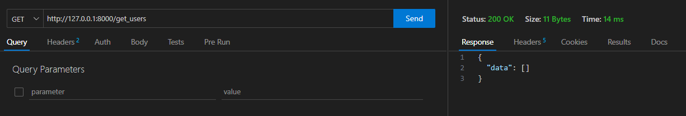
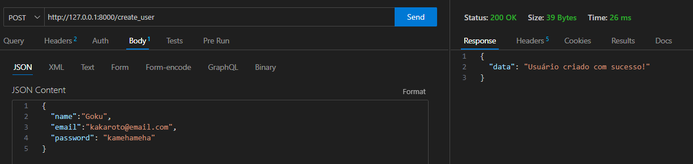
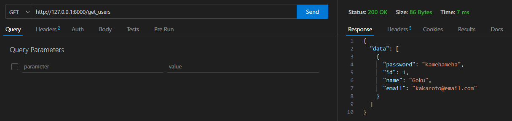
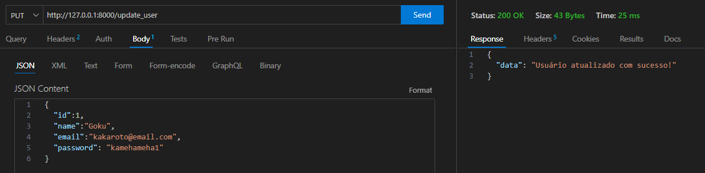
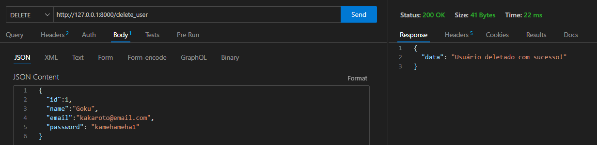

# CRUD com FastAPI, SQLAlchemy e PostgreSQL v1.0

O objetivo deste projeto é apresentar uma sugestão de estrutura para o desenvolvimento de uma API com FastAPI, SQLAlchemy e PostgreSQL. Ela será deployada em um conjunto de imagens Docker, que serão todas lançadas utilizando um arquivo ***docker-compose***.
Durante a construção desta API, o processo será implementado utilizando uma abordagem incremental, onde cada passo será documentado e versionado. O objetivo é apresentar uma sugestão de estrutura para o desenvolvimento de uma API com FastAPI, SQLAlchemy e PostgreSQL.

## Requisitos

- Python >= 3.8
- FastAPI
- Uvicorn
- Docker
- SQLAlchemy >= 2.0
- psycopg2

## Recomendação de Leitura

- [A Psycopg 2 vs Psycopg3 (3.0.15) benchmark](https://www.spherex.dev/psycopg-2-vs-psycopg3/)

## Instalação

As bibliotecas necessárias para a execução do projeto estão no arquivo `requirements.txt`. Para instalar, execute o comando abaixo:

```bash
python -m pip install -r requirements.txt
```

> ***ATENÇÃO:*** *É recomendado a utilização de um ambiente virtual para a instalação das bibliotecas. Para mais informações, acesse o [link](https://docs.python.org/pt-br/3/library/venv.html).*

Para criar um ambiente virtual, execute o comando abaixo (para Windows):

```bash
python -m venv .
cd Scripts
activate
```

O que vai acontecer com a sequencia de comandos acima, um ambiente virtual será criado na pasta atual. Em sequencia, navegamos para o diretório ***Scripts***, e ativamos o ambiente virtual executando o script ***activate***. Na sequencia, vamos avaliar se o ambiente virtual foi ativado corretamente, executando o comando abaixo:

```bash
where python
```

A saída esperada é a seguinte:

```bash
C:\Users\usuario\Documents\crud-docker-compose\Scripts\python.exe
C:\Users\usuario\AppData\Local\Programs\Python\Python38\python.exe
```

Os diretórios que são criados para o ambiente virtual são:
- Include
- Lib
- Scripts

Esses diretórios e o arquivo ***pyvenv.cfg*** são criados na pasta onde o comando ***python -m venv .*** foi executado. Eles podem ser adicionados ao ***.gitignore***, pois se for necessário recriar esses diretórios, basta recriar o venv. Exemplo de gitignore:

```gitignore
Include
Lib
Scripts
pyvenv.cfg
```

Para desativar o ambiente virtual, execute o comando abaixo, dentro do diretório Scripts:

```bash
deactivate
```

## Desenvolvimento do Projeto

A primeira versão do projeto será construída e refatorada para chegarmos ao projeto final. Para construir o projeto, vamos realizar um CRUD de usuários, onde cada usuário terá um nome, e-mail e senha. Para isso, vamos utilizar o FastAPI, SQLAlchemy e PostgreSQL.
Nossa tabela de usuários tera o seguinte formato:

| id | name | email | password |
| -- | ---- | ----- | -------- |
| 1  | Goku | kakaroto@email.com | kamehameha |
| 2  | Vegeta | principe@email.com | bulmas2 |

> ***IMPORTANTE:*** para está versão do projeto, ainda não será implementado um bom mecanismo para proteger as senhas dos usuários, elas serão armazenadas como Strings simples no banco de dados. Em versões futuras, será implementado um mecanismo de criptografia para proteger as senhas dos usuários. ***Ë MUITO IMPORTANTE ESTAR CIENTE QUE ESTÁ ABORDAGEM NÃO É RECOMENDADA PARA AMBIENTES DE PRODUÇÃO.***

Nosso banco vai se chamar ***banco-app***, e nossa tabela de usuários vai se chamar ***Users***. Para utilizarmos um banco com o SGBD Postgres, precisamos criar ele primeiro. A utilização do Postgres vai acontecer por sua imagem oficial no Docker Hub, que pode ser encontrada [aqui](https://hub.docker.com/_/postgres). Para criar o banco, vamos utilizar o seguinte comando:

```bash
docker run --name banco-container -e POSTGRES_PASSWORD=postgres -e POSTGRES_USER=admin -e POSTGRES_DB=banco-app -p 5432:5432 -d postgres
```

O que está acontecendo aqui é o seguinte:
- `docker run`: comando para criar um container
- `--name banco-container`: nome do container
- `-e POSTGRES_PASSWORD=postgres`: variável de ambiente para definir a senha do usuário postgres
- `-e POSTGRES_USER=admin`: variável de ambiente para definir o usuário do banco
- `-e POSTGRES_DB=banco-app`: variável de ambiente para definir o nome do banco
- `-p 5432:5432`: mapeamento de porta do container para a máquina local
- `-d postgres`: imagem utilizada para criar o container

Para verificar se o container foi criado corretamente, execute o comando abaixo:

```bash
docker ps
```

A saída esperada é a seguinte:

```bash
CONTAINER ID   IMAGE                           COMMAND                  CREATED              STATUS              PORTS                    NAMES
9c32cd2be4e4   postgres                        "docker-entrypoint.s…"   About a minute ago   Up About a minute   0.0.0.0:5432->5432/tcp   banco-container
```

Para verificar se o banco foi criado corretamente, execute o comando abaixo:

```bash
docker exec -it banco-container psql -U admin -d banco-app
```

A saída esperada é a seguinte:

```bash
psql (15.4 (Debian 15.4-1.pgdg120+1))
Type "help" for help.

banco-app=#
```	

Para sair do banco, execute o comando abaixo:

```bash
\q
```

Agora vamos iniciar nossa aplicação que vai se conectar ao banco. Para isso, vamos criar um arquivo chamado `main.py`, com o seguinte conteúdo:

```python
from fastapi import FastAPI
from sqlalchemy import create_engine
from sqlalchemy.ext.declarative import declarative_base
from sqlalchemy import Column, Integer, String
from sqlalchemy.orm import Session

# Constantes
DB_USER = "admin"
DB_PASSWORD = "postgres"
DB_HOST = "127.0.0.1"
DB_PORT = "5432"
DB_NAME = "banco-app"

# Cria a engine de dados para o postgres
engine = create_engine(f"postgresql+psycopg2://{DB_USER}:{DB_PASSWORD}@{DB_HOST}:{DB_PORT}/{DB_NAME}")

# Cria uma seção no banco
session = Session(engine)

# Cria a base para os modelos
Base = declarative_base()

#Define a tabela base
class User(Base):
    """
    Classe que representa a tabela de Usuários do sistema
    """
    __tablename__ = "Users"

    id = Column(Integer, primary_key=True, autoincrement=True)
    name = Column(String(255), nullable=False)
    email = Column(String(255), nullable=False)
    password = Column(String(255), nullable=False)

    def __repr__(self):
        return f"<User(id={self.id}, name={self.name}, email={self.email}, password={self.password})>"

# Cria a tabela no banco se ela já não existir
Base.metadata.create_all(engine, checkfirst=True)

app = FastAPI()

@app.get("/get_users")
def get_users():
    users = session.query(User).all()
    return {"data":users}
```

O que está acontecendo aqui é o seguinte:
- Importamos a classe FastAPI do pacote fastapi
- Importamos a função create_engine do pacote sqlalchemy
- Importamos a função declarative_base do pacote sqlalchemy.ext.declarative
- Importamos a classe Column, Integer e String do pacote sqlalchemy
- Importamos a classe Session do pacote sqlalchemy.orm
- Criamos uma engine de dados para o postgres
```python
# Constantes
DB_USER = "admin"
DB_PASSWORD = "postgres"
DB_HOST = "127.0.0.1"
DB_PORT = "5432"
DB_NAME = "banco-app"
# Cria a engine de dados para o postgres
engine = create_engine(f"postgresql+psycopg2://{DB_USER}:{DB_PASSWORD}@{DB_HOST}:{DB_PORT}/{DB_NAME}")
```
- Criamos uma seção no banco
```python
# Cria uma seção no banco
session = Session(engine)
```
- Criamos a base para os modelos
- Definimos a tabela base
```python	
# Cria a base para os modelos
Base = declarative_base()

#Define a tabela base
class User(Base):
    """
    Classe que representa a tabela de Usuários do sistema
    """
    __tablename__ = "Users"

    id = Column(Integer, primary_key=True, autoincrement=True)
    name = Column(String(255), nullable=False)
    email = Column(String(255), nullable=False)
    password = Column(String(255), nullable=False)

    def __repr__(self):
        return f"<User(id={self.id}, name={self.name}, email={self.email}, password={self.password})>"
```
- Criamos a tabela no banco se ela já não existir
- Criamos uma instância da classe FastAPI
- Criamos uma rota para a aplicação, que é a rota responsável por trazer todo o conteúdo da tabela Users

Ao utilizarmos o Thunder Client para verificar essa rota, é possível ver que uma lista vazia é retornada:



Agora vamos criar a rota para adicionar um usuário ao banco

```python
from fastapi import FastAPI, Body

# Restante do código anterior

@app.post("/create_user")
def create_user(data: dict = Body()):
    usuario = User(name = data['name'], email = data['email'], password = data['password'])
    session.add(usuario)
    session.commit()
    return {"data": "Usuário criado com sucesso!"}

```

Após executar a rota, é possível ver que o usuário foi criado com sucesso:



Ao testarmos a rota para verificar a lista de usuários, é possível ver que o usuário foi adicionado com sucesso:



Agora vamos criar a rota para atualizar um usuário no banco

```python
# Restante do código anterior

@app.put("/update_user")
def update_user(data: dict = Body()):
    usuario = session.query(User).filter(User.id == data['id']).first()
    usuario.name = data['name']
    usuario.email = data['email']
    usuario.password = data['password']
    session.commit()
    return {"data": "Usuário atualizado com sucesso!"}
```

O retorno da API será:



Agora, vamos criar uma nova rota para deletar um usuário

```python
# Código anterior
@app.delete("/delete_user")
def delete_user(data: dict = Body()):
    usuario = session.query(User).filter(User.id == data['id']).first()
    session.delete(usuario)
    session.commit()
    return {"data": "Usuário deletado com sucesso!"}
```

O resultado da chamada pode ser observado em:




## Docker

## Docker-Compose