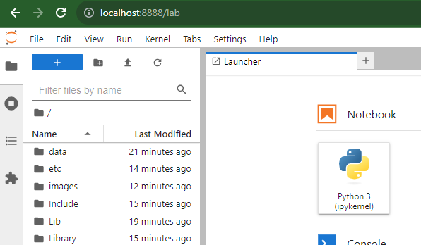

# Gerando Modelos com PyCaret v1.0

O objetivo deste projeto é compreender como utilizar o PyCaret para gerar modelos de Machine Learning. Para isso, vamos utilizar o dataset [Video Game Sales](https://www.kaggle.com/datasets/gregorut/videogamesales). Um modelo de regressão será construído para prever as vendas globais de um jogo, com base nas informações disponíveis no dataset.

## Requisitos

- Python >= 3.8
- PyCaret 3.0
- Docker

## Recomendação de Leitura

- [Documentação do PyCaret](https://pycaret.gitbook.io/docs/)
- [PyCaret Tutorial: A beginner's guide for automating ML workflows using PyCaret](https://www.datacamp.com/tutorial/guide-for-automating-ml-workflows-using-pycaret)
- [Getting Started with PyCaret](https://www.kdnuggets.com/2022/11/getting-started-pycaret.html)
- [A Gentle Introduction to PyCaret for Machine Learning](https://machinelearningmastery.com/pycaret-for-machine-learning/)

## Instalação

As bibliotecas necessárias para a execução do projeto estão no arquivo `requirements.txt`. Para instalar, execute o comando abaixo:

```bash
python -m pip install -r requirements.txt
```

> ***ATENÇÃO:*** *É recomendado a utilização de um ambiente virtual para a instalação das bibliotecas. Para mais informações, acesse o [link](https://docs.python.org/pt-br/3/library/venv.html).*

> ***IMPORTANTE:*** A instalação do PyCaret leva um tempo considerável. Estamos trabalhando com a versão completa do pacote de instalação. Para mais informações, acesse o [link](https://pycaret.org/install/).

Para criar um ambiente virtual, execute o comando abaixo (para Windows):

```bash
python -m venv .
cd Scripts
activate
```

O que vai acontecer com a sequencia de comandos acima, um ambiente virtual será criado na pasta atual. Em sequencia, navegamos para o diretório ***Scripts***, e ativamos o ambiente virtual executando o script ***activate***. Na sequencia, vamos avaliar se o ambiente virtual foi ativado corretamente, executando o comando abaixo:

```bash
where python
```

A saída esperada é a seguinte:

```bash
C:\Users\usuario\Documents\criando-uma-api-fastapi-basic\Scripts\python.exe
C:\Users\usuario\AppData\Local\Programs\Python\Python38\python.exe
```

Os diretórios que são criados para o ambiente virtual são:
- Include
- Lib
- Scripts

Esses diretórios e o arquivo ***pyvenv.cfg*** são criados na pasta onde o comando ***python -m venv .*** foi executado. Eles podem ser adicionados ao ***.gitignore***, pois se for necessário recriar esses diretórios, basta recriar o venv. Exemplo de gitignore:

```gitignore
Include
Lib
Scripts
pyvenv.cfg
share
xgboost
etc
images
Library
```

Para desativar o ambiente virtual, execute o comando abaixo, dentro do diretório Scripts:

```bash
deactivate
```

> ***Observação:*** É possível executar o PyCaret direto de uma imagem Docker. Para mais informações, acesse o [link](https://pycaret.org/install/). Para executar a imagem, utilizar o seguinte comando:

```bash
# default version
docker run -p 8888:8888 pycaret/slim

# full version
docker run -p 8888:8888 pycaret/full
```

## Desenvolvimento do Projeto

Para iniciar o desenvolvimento do projeto, vamos iniciar um notebook Jupyter. Para isso, execute o comando abaixo:

```bash
jupyter lab
```

Agora vamos iniciar um novo notebook com a nossa aplicação. Para isso, vamos clicar no botão ***Python 3***, dentro da aba ***Notebook***.



- TODO

## Docker

- TODO